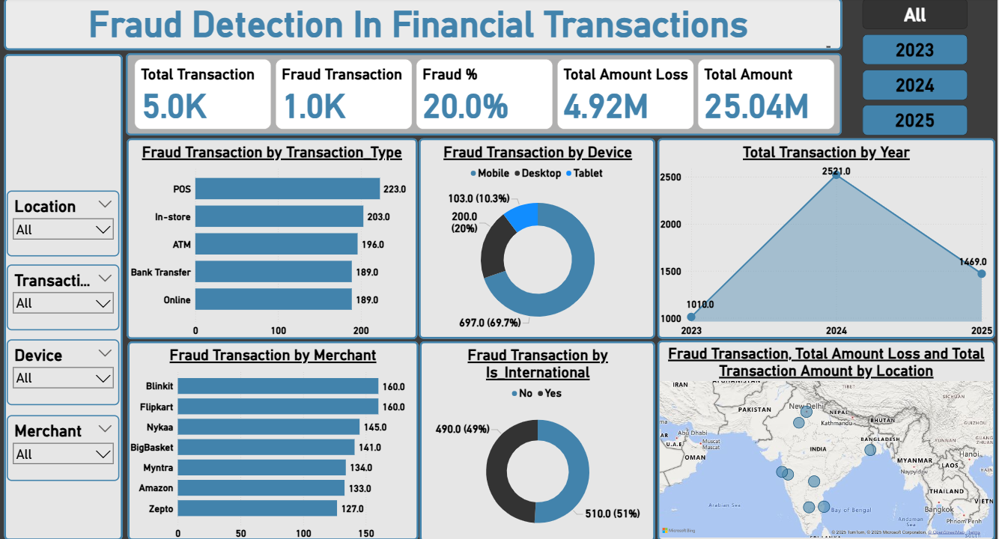

# Fraud detection in Financial Transaction

– Analyzed 5,000+ financial transactions using advanced SQL queries to detect fraud based on device type, location,
transaction type, and country risk indicators.

– Identified high-risk patterns such as international transactions from flagged countries and built logic for fraud score
classification.

– Built an interactive Power BI dashboard with KPIs (Fraud Count, Fraud percentage and Total Transactions) and slicers
for Country, Device, Merchant, and Transaction Type.

– Presented actionable insights through data storytelling, helping stakeholders visualize fraud hotspots and improve risk
management strategies.


# Power BI Dashboard



# SQL

Sql Business problem Solution 

Section 1: Basic Understanding

Q1. Total number of transactions and customers

```
select 
     count(*) as total_transaction , 
     count(distinct customer_id) as total_cust
from fraud_data;
```
Q2. Number of fraud vs non-fraud transactions


```
select 
   Fraud_Flag ,
   count(*) as total_tansactions
from fraud_data
group by 1
order by 2 desc;
```

Q3. Average transaction amount (fraud vs non-fraud)

```
select 
    Fraud_Flag,
    round(avg(Amount) , 2) as avg_transaction_amount
from fraud_data
group by 1
order by 2 desc;
```


Section 2: Fraud by Geography & Device

Q4. Top 5 locations with most fraud

```
select location, count(*) as Fraud_count
from fraud_data
where fraud_flag = "Fraud"
group by 1
order by 2 desc
limit 5;
```

Q5. Devices used in most fraudulent transactions

```
select Device, count(*) as Fraud_count
from fraud_data
where fraud_flag = "Fraud"
group by Device
order by 2 desc;
```

Section 3: International & High-Risk Transactions

Q6. Fraud % in international transactions

```
select 
     is_international,
     count(*) as total_transaction,
     sum(case when fraud_flag = 'Fraud' then 1 else 0 End) as fraud_count,
	 concat(round (sum(case when fraud_flag = 'Fraud' then 1 else 0 End) * 100  / count(*) ,2) ,"%") as Fraud_rate
from fraud_data
group by 1;
```

Q7. High-risk city fraud comparison

```
select
     is_highrisk_country,
     sum(case when fraud_flag = 'Fraud' then 1 else 0 End) as fraud_transaction,
     count(*) as total_transaction,
	 round (sum(case when fraud_flag = 'Fraud' then 1 else 0 End) * 100  / count(*) ,2) as Fraud_rate
from fraud_data
group by 1;
```

Section 4: Temporal Analysis

Q8. Fraud trend by month

```
select 
     month(transaction_date),
     monthname(transaction_date),
     count(*) as total_transaction,
     sum(case when fraud_flag = "Fraud" then 1 else 0 end) as fraud_count
from fraud_data
group by 1,2
order by 1;
```

Q9. Time of day with most fraud (Morning/Afternoon/Evening/Night)

```
select 
     case when hour(transaction_time) >= 5 and  hour(transaction_time) < 12 then "Morning" 
          when hour(transaction_time) >= 12 and hour(transaction_time) <= 17 then "Afternoon"
          when hour(transaction_time) > 17 and hour(transaction_time) <= 22 then "Evening"
          else "Night" 
	 end as day_shift,
     count(*) as total_transaction,
     sum(case when fraud_flag = "fraud" then 1 else 0 end) as fraud_count,
     concat(round( (sum(case when fraud_flag = "fraud" then 1 else 0 end) * 100.0) / count(*) ,2) ,"%") as fraud_rate
from fraud_data
group by 1
order by 3 desc;
```

-- ----------------------------------------------------------------------------------------------------------------------------

Section 5: Merchant & Transaction Type

Q10. Merchants with highest fraud counts

```
select merchant, count(*) as fraud_count
from fraud_data
where fraud_flag = "Fraud"
group by merchant
order by 2 desc;
```

Q11. Fraud rate by transaction type

```
select 
   transaction_type, 
   count(*) as total_transaction,
   sum(case when fraud_flag = "fraud" then 1 else 0 end) as fraud_count,
   concat(round(sum(case when fraud_flag = "fraud" then 1 else 0 end) * 100 / count(*) ,2)  ,"%") as fraud_rate
from fraud_data
group by 1
order by 3 desc
;
```
-- -------------------------------------------------------------------------------------------------------------------------------------------

Section 6: Risk Profiling

Q12. Customers with more than 3 frauds

```
select customer_id, count(*) as customer_count
from fraud_data
where fraud_flag = "fraud"
group by 1
having count(*) > 3;
```

Q13. Transactions over ₹5000 that are fraudulent 

```
select *
from fraud_data
where fraud_flag = "fraud" and Amount > 5000;
```
